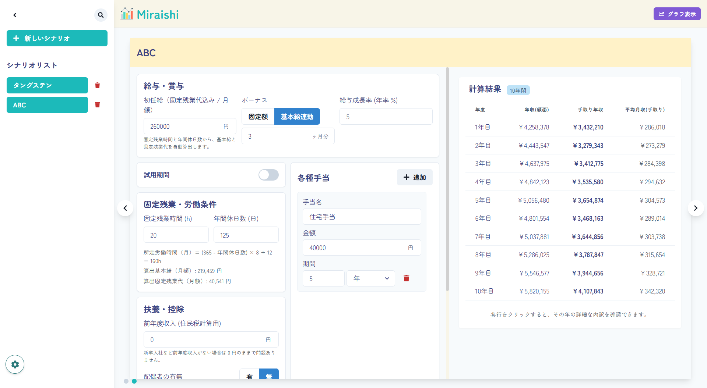

# Miraishi - 未来視

<p align="center">
  
</p>

<p align="center">
  <strong>給与推移と手取りを可視化する、キャリアシミュレーション用デスクトップアプリ</strong>
</p>

## 概要

Miraishi は Electron + React + TypeScript で構築された給与シミュレーションアプリです。  
複数シナリオを比較しながら、税制スキーマ（YAML）を編集・検証・履歴復元し、比較レポートを PDF 出力できます。

- リリース: <https://github.com/syugeeeeeeeeeei/Miraishi/releases>
- バージョン: `2.0.0`（`package.json`）

## 現行機能（実装ベース）

- シナリオ管理
- シナリオの新規作成、複数選択、検索、削除
- 複数シナリオ選択時のカード切り替え（矢印ボタン + マウスホイール）
- 入力変更時の自動保存・自動再計算
- シナリオ入力
- 初任給（固定残業代込み）、固定残業時間、年間休日数
- ボーナス（固定額 / 基本給連動）
- 試用期間、各種手当（期間付き）
- 扶養情報、前年度収入、勤務都道府県、業種
- 計算結果表示
- 年度ごとの `年収(額面)` / `手取り年収` / `平均月収(手取り)`
- 年度行クリックで内訳モーダル（収入・控除の内訳、計算フロー）
- グラフ表示
- 複数シナリオの年収推移比較（折れ線）
- 予測期間（1-50年）、月平均残業時間（0-100h）、表示項目切り替え
- 税制スキーマ管理（YAML）
- 編集、構文/構造/意味検証、差分サマリ確認
- スナップショット履歴管理、復元
- 比較レポート PDF 出力
- 2件以上のシナリオ比較を A4 PDF として保存
- 出力対象年、残業時間、出力セクションを指定可能

## リポジトリ構成

```text
src/
  main/        # Electron Main Process (IPC, 計算, スキーマ管理, PDF生成)
  preload/     # contextBridge 経由の Renderer API 公開
  renderer/    # React UI (ControlPanel, ScenarioWorkspace, GraphView など)
  types/       # 共有型定義
  shared/      # 共通定数（都道府県・業種デフォルトなど）
resources/
  schema/tax_schema.yaml  # 同梱税制スキーマ
docs/
  readmes/     # 正式ドキュメントハブ（要件・仕様・取扱説明書）
```

## 技術スタック

- Electron 35
- React 19 + Vite
- TypeScript 5
- Chakra UI + Framer Motion
- Jotai
- Chart.js (`react-chartjs-2`)
- CodeMirror（YAML エディター）
- electron-store
- Zod / YAML
- Vitest / ESLint / Prettier

## セットアップ

前提:

- Node.js（Corepack 利用可能なバージョン）
- Yarn 4（`packageManager: yarn@4.9.2`）

```bash
corepack enable
yarn install
```

## 開発・検証コマンド

```bash
# 開発起動
yarn dev

# プレビュー起動
yarn start

# 静的検査
yarn lint
yarn typecheck

# テスト
yarn test

# ビルド
yarn build

# フォーマット
yarn format
```

## 配布ビルド

```bash
# unpack 形式
yarn deploy:unpack

# Windows 配布（GitHub publish 前提）
yarn deploy:win

# Windows(NSIS) 配布
yarn deploy:win:nsis
```

補足:

- `electron-builder.yml` は Windows 設定（`win`, `nsis`）を含みます。
- `deploy:win` / `deploy:win:nsis` は `dotenv` 経由で環境変数を読み込みます。

## 環境変数

配布処理では `.env` に `GH_TOKEN` を設定して使用します（GitHub publish 用）。  
`.env` は `.gitignore` 対象です。

例:

```bash
GH_TOKEN=your_github_token
```

## ドキュメント

詳細仕様・運用ドキュメントは以下を参照してください。

- `docs/readmes/README.md`
- `docs/readmes/requirements_definition.md`
- `docs/readmes/specification.md`
- `docs/readmes/user_manual.md`
