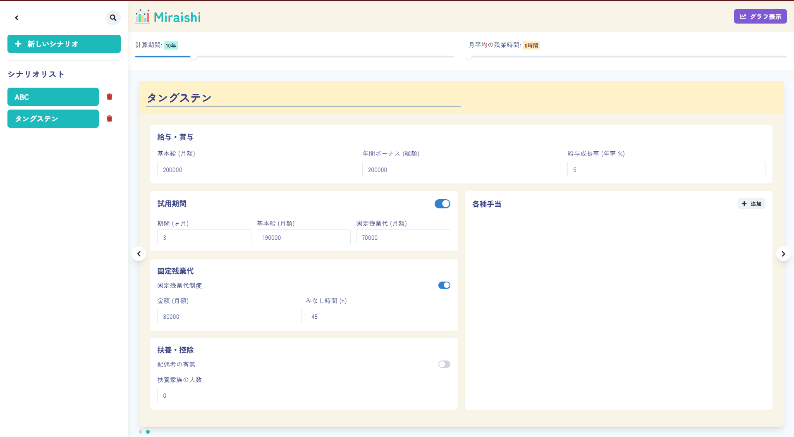

# Miraishi - 未来視

<p align="center">
  
</p>

<p align="center">
  <strong>あなたのキャリアプランを可視化する、給与推移シミュレーションアプリ</strong>
</p>

<p align="center">

</p>

---

## 📖 概要

**Miraishi (未来視)** は、自身のキャリアプランに基づいた将来の給与推移を詳細にシミュレーションするためのデスクトップアプリケーションです。

基本給や手当、昇給率、さらには税金や社会保険料までを考慮したリアルな手取り額を予測し、グラフで可視化することで、キャリアプランニングを強力にサポートします。
このREADMEは、リポジトリ内のコードに基づき、現在実装されている機能を正確に記述しています。

## ✅️ ダウンロード

ダウンロードは[GitHubのリリースページ](https://github.com/syugeeeeeeeeeei/Miraishi/releases)から。

## ✨ 機能詳細

### 🎨 メイン画面 (DataView & ControlPanel)

メイン画面は、左側のシナリオ管理パネルと中央のデータ表示エリアで構成されます。

- **シナリオ管理パネル (左側)**

  - **パネル開閉**: マウスホバーまたはクリックでパネルがスムーズに開閉します。
  - **シナリオ新規作成**: `+`ボタンから新しいシミュレーションシナリオを即座に作成できます。
  - **シナリオ一覧と選択**:
    - 保存されている全シナリオを一覧表示。
    - チェックボックス形式で複数のシナリオを同時に選択し、グラフで比較することが可能です。
    - 各シナリオの削除もこのパネルから行います。
  - **シナリオ検索**: タイトル名でシナリオをリアルタイムに絞り込み検索できます。

- **データ表示エリア (中央)**
  - **シナリオ切替**: 複数シナリオを選択している場合、左右の矢印ボタンで表示するシナリオを切り替えるカルーセル形式のUIを採用しています。
  - **入力と結果のビュー切替**: マウスホイールの上下スクロールで、データ入力画面と計算結果の表示をシームレスに切り替えることができます。

### ✍️ データ入力機能

各シナリオに対して、非常に詳細な条件設定が可能です。入力内容は自動で保存されます。

- **シナリオタイトル**: 各シナリオのタイトルを自由に変更できます。
- **基本情報**:
  - `基本給 (月額)`
  - `年間ボーナス (総額)`
  - `給与成長率 (年率 %)`
- **試用期間**:
  - トグルスイッチで制度の有無を設定。
  - 有効な場合、`期間 (ヶ月)` `期間中の基本給` `期間中の固定残業代` を設定できます。
- **固定残業代**:
  - トグルスイッチで制度の有無を設定。
  - 有効な場合、`金額 (月額)` と `みなし時間 (h)` を設定できます。
- **扶養・控除**:
  - `配偶者の有無`をトグルスイッチで設定。
  - `配偶者以外の扶養家族の人数` を入力できます。
- **各種手当**:
  - `+ 追加`ボタンで手当入力欄を動的に追加可能。
  - 各手当に対して`手当名`、`金額`、`支給期間 (無期限, N年, Nヶ月)` を個別に設定できます。

### 🧮 計算と結果表示

- **リアルタイム再計算**: データ入力やグラフの表示設定（予測期間・残業時間）を変更すると、シミュレーション結果が即座に再計算され、UIに反映されます。
- **詳細な計算ロジック**:
  - `src/main/lib/calculator.ts` にて、試用期間、手当の支給期限、各種控除を考慮した詳細な計算を実行。
  - 税率や社会保険料率は `resources/schema/tax_schema.json` から読み込むため、メンテナンス性が高い構造です。
- **計算結果テーブル**:
  - 年度ごとの `年収(額面)`、`手取り年収`、`平均月収(手取り)` をテーブル形式で表示。
  - テーブルの各行をクリックすると、その年の収入と控除（健康保険、厚生年金、所得税など）の詳細な内訳をモーダルウィンドウで確認できます。
- **投機的バックグラウンド計算**:
  - アプリ起動時に最初のシナリオの計算をバックグラウンドで実行し、キャッシュしておくことで、初回表示の高速化を図っています (`src/main/index.ts`)。

### 📊 グラフ表示機能

画面右からドロワー形式で表示されるグラフビューで、シミュレーション結果を視覚的に分析できます。

- **複数シナリオの重ね描き**: 選択した複数のシナリオの年収推移を、異なる色の折れ線グラフで一枚のチャート上に描画し、視覚的な比較を容易にします。
- **インタラクティブな表示設定**:
  - **予測期間**: スライダー操作で1年〜50年の間でシミュレーション期間を動的に変更可能。
  - **月平均の残業時間**: スライダー操作で0時間〜100時間の間で残業時間を設定し、給与への影響を即座に確認可能。
  - **表示項目の切り替え**: `年収(額面)` と `年収(手取り)` の表示をチェックボックスで自由にON/OFFできます。

## 🛠️ 技術スタック

- **フレームワーク**: Electron, React, Vite
- **言語**: TypeScript
- **UIコンポーネント**: Chakra UI, Framer Motion (アニメーション)
- **状態管理**: Jotai
- **グラフ描画**: Chart.js (react-chartjs-2)
- **データ永続化**: electron-store
- **スキーマバリデーション**: Zod
- **コード品質**: ESLint, Prettier

## 🚀 セットアップと実行

### 依存関係のインストール

```bash
yarn
```

### 開発モードで起動

```bash
yarn dev
```

### アプリケーションのビルド

```bash
# Windows
yarn build:win

# macOS
yarn build:mac
```
